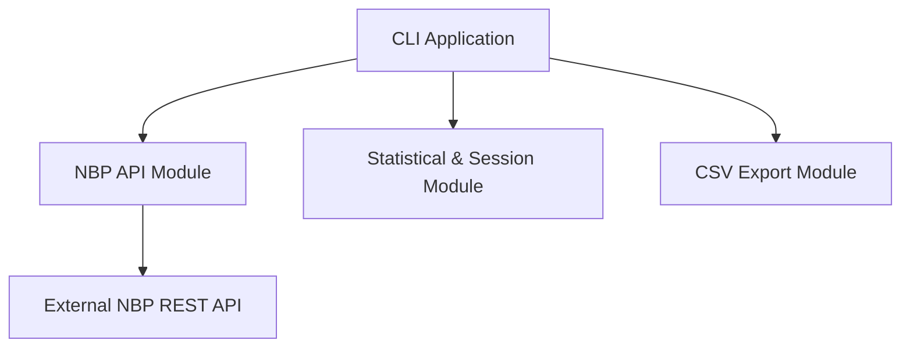
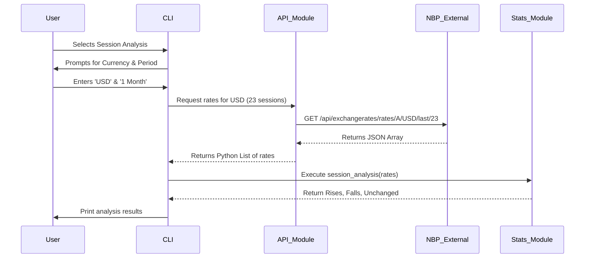
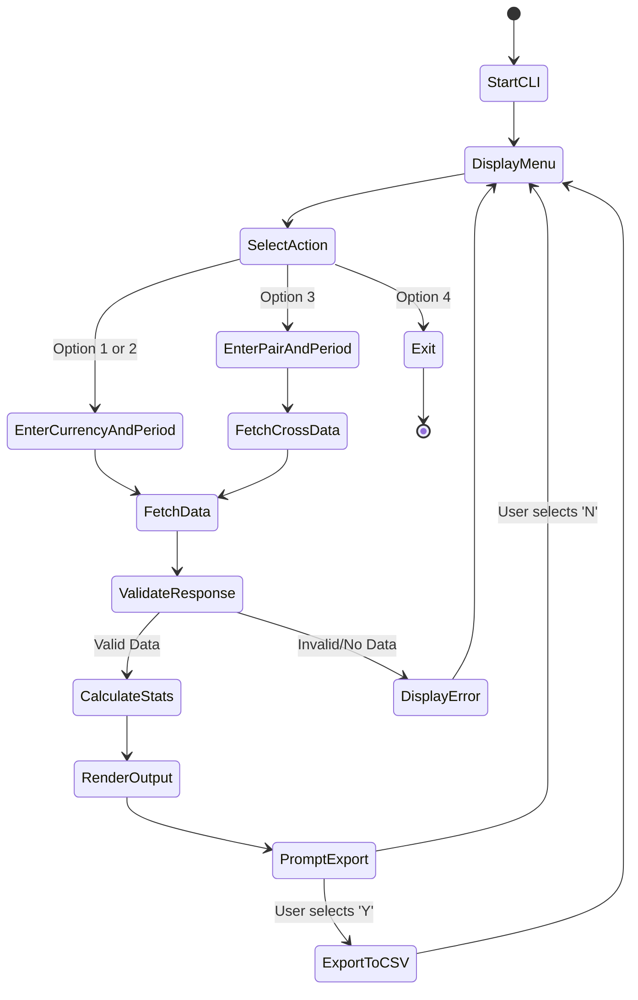

# Architecture & System Diagrams

The Currency Analytics System (CAS) design incorporates several UML diagrams describing the software's components, control flow, and interactions.

## 1. System Architecture Description
The system follows a modular Monolithic Architecture. The core elements include:
- **CLI Interface (`main.py`)**: Handles user input and navigation.
- **Analysis Engine (`analysis.py`)**: Performs statistical rules processing offline (Mode, Median, Standard Deviation, Variation Coefficient) and histogram calculations.
- **NBP API Integration (`api.py`)**: Connects to the external NBP Web API. Handles URL parsing, date ranges, HTTP errors and returns sanitized variables.
- **File Exporter (`export.py`)**: Utility feature for dumping arrays into CSV files.

---

## 2. Component Diagram

---

## 3. Sequence Diagram (Session Analysis Flow)

---

## 4. Activity Diagram

