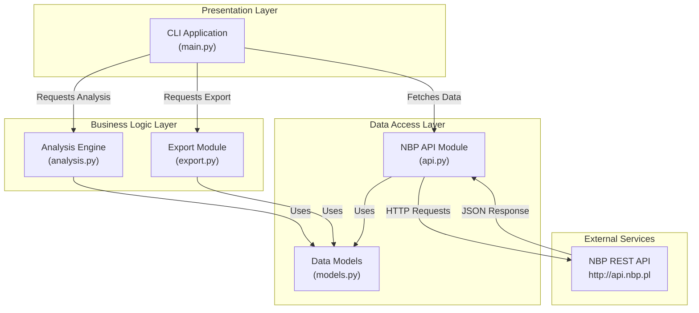
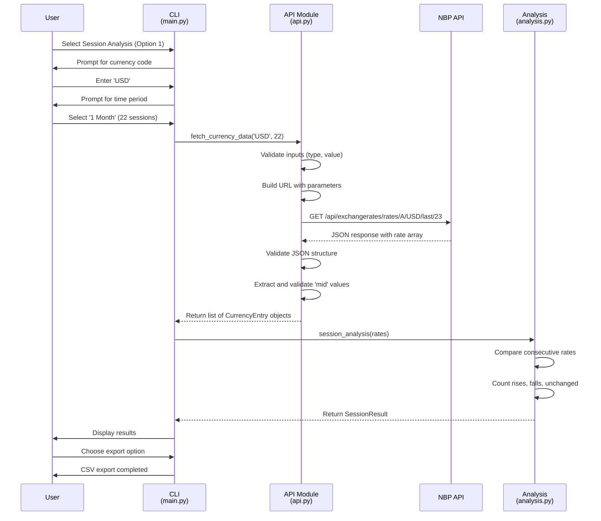
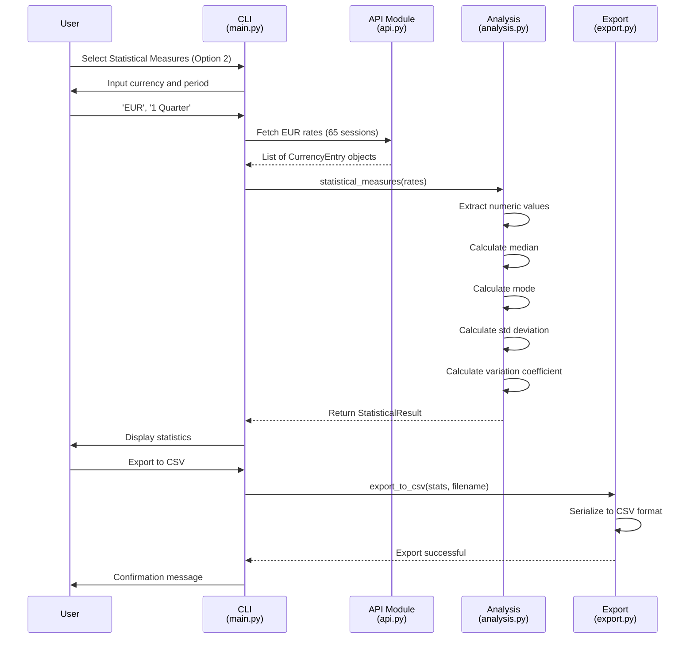
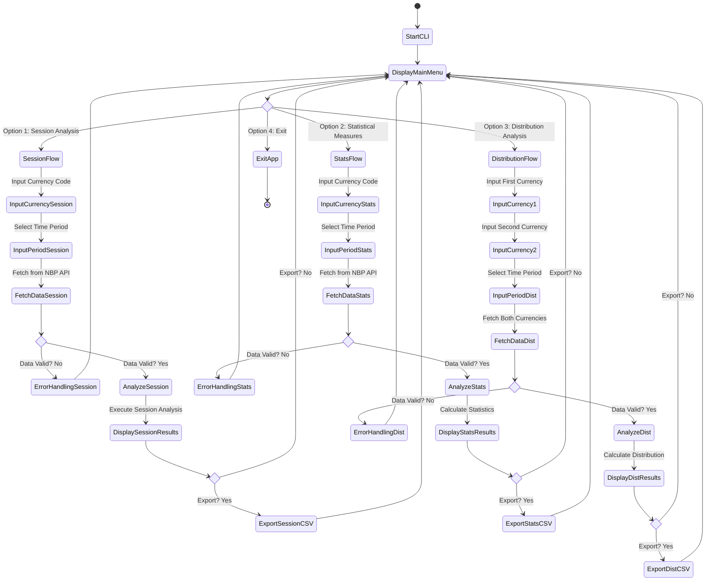
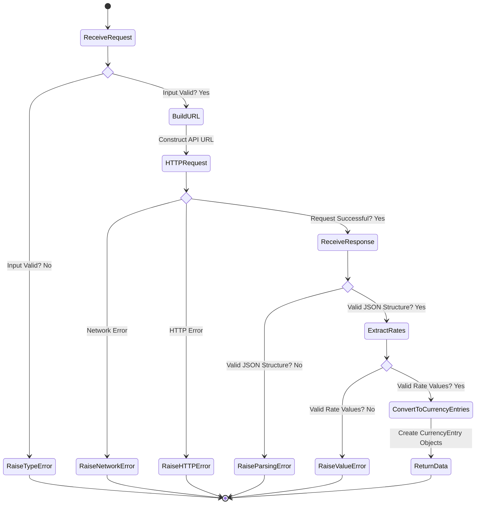

# Architecture & System Design Documentation

## Table of Contents
1. [System Architecture Overview](#system-architecture-overview)
2. [Component Architecture](#component-architecture)
3. [Module Description](#module-description)
4. [Data Flow and Sequence Diagrams](#data-flow-and-sequence-diagrams)
5. [Activity Workflows](#activity-workflows)
6. [Technology Stack](#technology-stack)

---

## System Architecture Overview

The Currency Analytics System (CAS) follows a **modular monolithic architecture** designed for clarity, maintainability, and extensibility. The system is composed of distinct, loosely-coupled modules that interact through well-defined interfaces.

### Architectural Principles

- **Separation of Concerns**: Each module has a single, well-defined responsibility
- **Modularity**: Independent modules can be tested and modified separately
- **Extensibility**: New analysis features can be added without modifying existing code
- **Error Handling**: Comprehensive validation at all integration points
- **Data Validation**: Multi-layer validation for API responses and user inputs

### Layers

The system is organized into three logical layers:

1. **Presentation Layer** (`main.py`): User interface and interaction handling
2. **Business Logic Layer** (`analysis.py`): Core statistical calculations and data processing
3. **Data Access Layer** (`api.py`): External API integration and data retrieval

### Design Patterns

- **Factory Pattern**: Model instantiation (CurrencyEntry, SessionResult, etc.)
- **Decorator Pattern**: Data validation and sanitization
- **Error Handling Pattern**: Custom exception hierarchy for specific error cases

---

## Component Architecture

### High-Level Component Diagram



---

## Module Description

### 1. CLI Module (`main.py`)

**Responsibility**: User interaction and command orchestration

**Key Features**:
- Interactive menu system for user selection
- Input validation and user guidance
- Currency code input handling
- Period/timeframe selection
- Result presentation and formatting
- CSV export prompting

**Functions**:
- `display_menu()`: Renders the main menu options
- `get_currency()`: Accepts and validates currency codes
- `get_period()`: Presents period options for analysis
- `main()`: Main event loop handling user selections

**Dependencies**: 
- `api.fetch_currency_data()`
- `analysis.*` (analysis functions)
- `export.export_to_csv()`

---

### 2. API Integration Module (`api.py`)

**Responsibility**: Data retrieval and API communication with NBP

**Key Features**:
- HTTP communication with NBP REST API
- Request URL construction and validation
- JSON response parsing and validation
- Error handling for network and API failures
- Data sanitization and type validation
- Custom exception handling for API-specific errors

**Exception Hierarchy**:
- `DataParsingError`: Raised when API response cannot be parsed or validated

**Functions**:
- `fetch_currency_data(currency, sessions)`: Main API function
  - Validates input parameters
  - Constructs API URL
  - Performs HTTP request
  - Validates response structure
  - Returns list of CurrencyEntry objects
- `_validate_rates_payload(data)`: Validates JSON structure
- `_extract_mid_floats(rates)`: Extracts and validates numeric values

**Error Handling**:
- Pre-flight input validation (type checking, value ranges)
- Network error handling (ConnectionError, Timeout, SSL)
- API response validation (status codes, JSON structure)
- Data type validation (numeric values, non-null checks)

---

### 3. Analysis Engine (`analysis.py`)

**Responsibility**: Statistical calculations and data analysis

**Key Features**:
- Multiple statistical analysis modes
- Session movement analysis (rising/falling/unchanged)
- Distribution histogram calculations
- Robust error handling for edge cases

**Analysis Functions**:

#### Session Analysis
```
session_analysis(rates) -> SessionResult
- Compares consecutive rate values
- Counts rises, falls, and unchanged periods
- Returns: SessionResult with rising, falling, unchanged counts
```

#### Statistical Measures
```
statistical_measures(rates) -> StatisticalResult
- Calculates: Median, Mode, Standard Deviation, Coefficient of Variation
- Returns: StatisticalResult with all four metrics
```

#### Distribution of Changes
```
distribution_of_changes(rates1, rates2) -> List[DistributionRange]
- Analyzes cross-rate distribution patterns
- Creates histograms with configurable ranges
- Returns: List of DistributionRange objects
```

**Data Validation**:
- Type checking for input rates
- NaN/Infinity detection and handling
- Empty dataset edge cases
- Numeric precision preservation

---

### 4. Export Module (`export.py`)

**Responsibility**: Data export and file I/O operations

**Features**:
- CSV file generation
- Result serialization
- File system operations
- Error handling for I/O operations

**Functions**:
- `export_to_csv(results, filename)`: Main export function
  - Serializes result objects to CSV format
  - Creates output files
  - Handles file I/O errors

---

### 5. Data Models (`models.py`)

**Responsibility**: Data structure definitions

**Model Classes**:

```python
CurrencyEntry
├── mid (float): Exchange rate mid-value from NBP

SessionResult
├── rising (int): Count of rising sessions
├── falling (int): Count of falling sessions  
└── unchanged (int): Count of unchanged sessions

StatisticalResult
├── median (float): Median value
├── mode (float): Mode (most frequent) value
├── standard_deviation (float): Std deviation
└── coefficient_of_variation (float): CV ratio

DistributionRange
├── start (float): Range start value
├── end (float): Range end value
└── count (int): Items within range
```

---

## Data Flow and Sequence Diagrams

### Sequence Diagram: Session Analysis Flow



### Sequence Diagram: Statistical Analysis Flow



---

## Activity Workflows

### User Workflow: Main Application Flow



### API Data Processing Flow



---

## Technology Stack

### Programming Language
- **Python 3.10+**: Core implementation language with modern syntax and features

### Standard Libraries
- `statistics`: Statistical calculations (median, mode, stdev)
- `csv`: CSV file I/O operations
- `math`: Mathematical operations and precision handling
- `dataclasses`: Data model definitions with type hints
- `sys`: System exit and environment interaction

### External Libraries
- `requests (2.31.0)`: HTTP communication with NBP API
  - Connection management
  - Session handling
  - Error and timeout handling

### Testing & Quality Assurance
- `pytest (8.1.1)`: Unit testing framework
  - Test discovery and execution
  - Fixtures and parameterization
  - Mock and patch capabilities
  - Coverage reporting

### Development Environment
- **Version Control**: Git with GitHub repository
- **CI/CD**: GitHub Actions for automated testing
- **Documentation**: Markdown format for all technical documentation
- **Package Management**: pip for dependency management

---

## Performance Considerations

### Data Processing
- Efficient list iteration for statistical calculations
- Lazy evaluation where possible
- Memory-efficient streaming for large datasets
- Type checking to prevent runtime errors

### API Integration
- Connection timeout configuration for network resilience
- Rate limiting awareness for NBP API
- Error retry logic for transient failures
- Response caching considerations (future enhancement)

### Scalability
- Modular design allows independent scaling
- Analysis engine can process large rate arrays
- CSV export supports large result datasets

---

## Security Considerations

### Input Validation
- Strict type checking for all parameters
- Range validation for numeric inputs
- Currency code validation against NBP standards
- String sanitization for file operations

### API Communication
- HTTPS support for secure NBP API communication
- Request validation before API calls
- Response validation for injection prevention
- Error message sanitization to prevent information leakage

### Error Handling
- No credentials or sensitive data in error messages
- Safe exception handling without exposing system details
- Graceful degradation on error conditions

---

## Future Enhancements

### Planned Features
1. Multi-currency comparison analysis
2. Trend prediction using time series analysis
3. Caching layer for API responses
4. Configuration file support for customization
5. REST API wrapper for integration with other systems
6. Database persistence for historical analysis
7. Advanced statistical models (regression, correlation)
8. Real-time monitoring and alerting
9. Data visualization with charts and graphs
10. Batch processing for multiple currency analysis

### Architecture Improvements
1. Async/await for concurrent API calls
2. Plugin architecture for custom analysis modules
3. Message queue for handling large workloads
4. Microservices decomposition for independent scaling
5. API versioning strategy
6. Comprehensive logging and monitoring

---

## Deployment Architecture

### Development Environment
- Local Python environment with virtual isolation
- Direct execution of `main.py`
- Local test execution with pytest

### Production Environment
- Linux server with Python 3.10+ runtime
- Automated CI/CD pipeline via GitHub Actions
- Containerized deployment option (Docker)
- Environment-specific configuration management

### Monitoring and Maintenance
- Error logging and alerting
- Performance metrics collection
- Automated test execution on code changes
- Health checks for API connectivity

---

## References

- National Bank of Poland API: http://api.nbp.pl/
- Python Documentation: https://docs.python.org/3/
- pytest Documentation: https://docs.pytest.org/
- GitHub Actions: https://docs.github.com/en/actions
